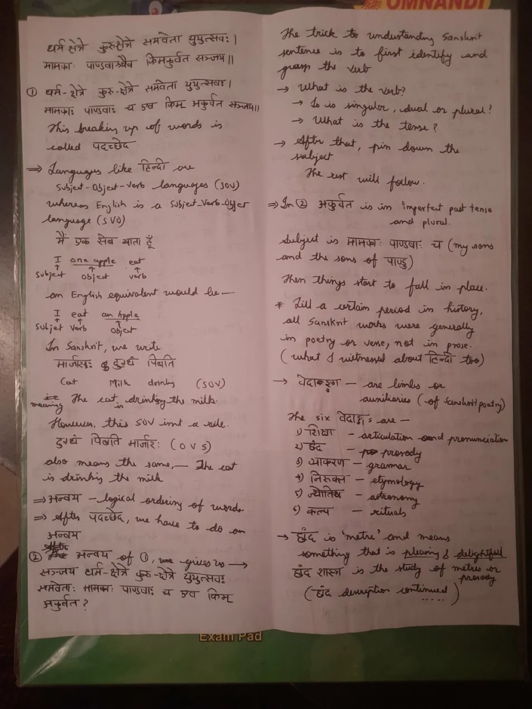
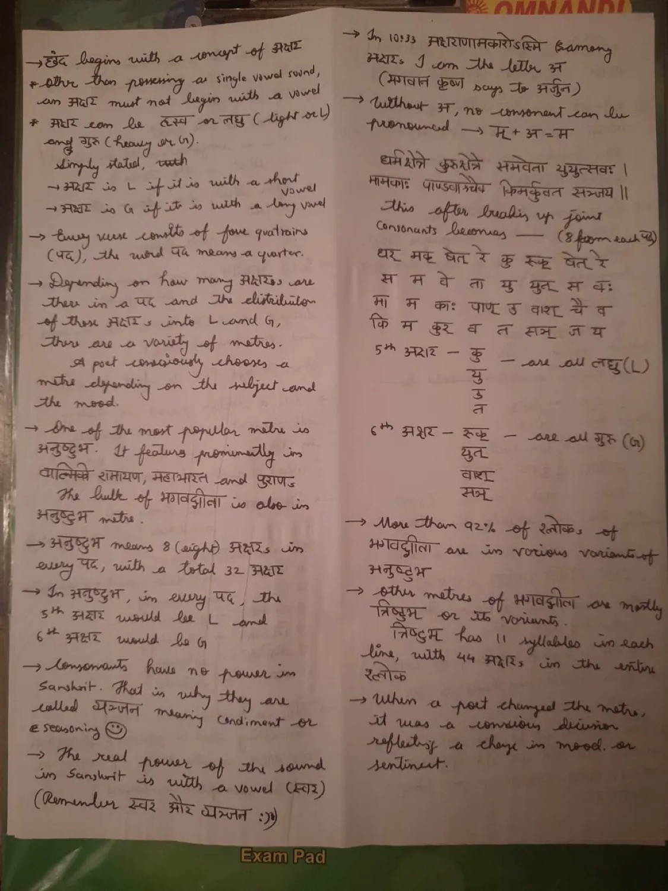
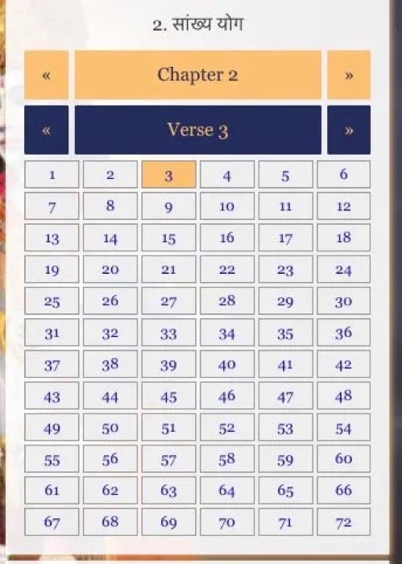
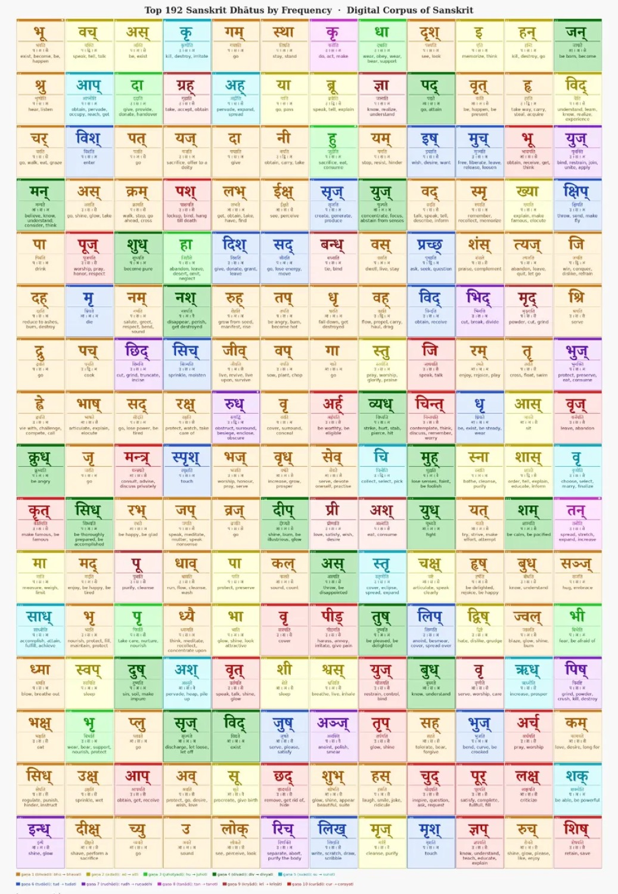
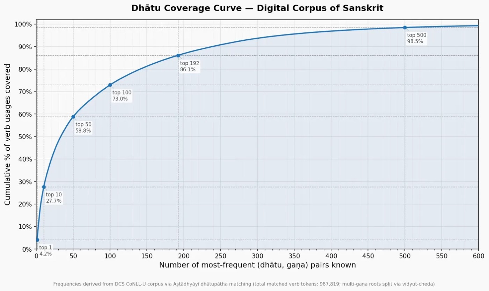

# गीताध्ययनम् — A working journal of Sanskrit, decoded one verse at a time

*An article on where this project came from, what it's trying to preserve, and how it grew.*

---

## The shape of a frustration

My opening line in the conversation that started this project, March 2026:

> *I remember learning Sanskrit in Maharashtra board 8–10th standard textbooks back in ~2006. The way it was taught was very weird, we had to do a* **ratta** *(rote learning) of nouns like देवः देवौ देवाः (and I think) these were only nouns and not verbs. Heck I don't think I remember anything about the verbs. I do remember about the* **समास** *(like बहुव्रीहि समास) but nothing about the verbs.*

The book was **Navneet's शब्द धातु रूपावलिः** — the famous Mumbai-published lookup-and-drill booklet that every Maharashtra SSC Sanskrit student gets. *नवनीत* literally means *butter* — fresh, soft — a slightly charming name for a book that was, for most students, anything but. Inside: the राम declension table. देवः, देवौ, देवाः. नरः, नरौ, नराः. Page after page of forms, memorized by rote for an exam, repeated until they're a kind of muscle memory disconnected from anything that means anything.

What that book never tells you is *where the table comes from*. It is the compiled binary. The source code — Pāṇini's अष्टाध्यायी, one of the most sophisticated formal generative grammars ever written, two-and-a-half thousand years old — is a generative system that **derives** these forms. Apply rule, apply sandhi, get form. The table is the output.

Maharashtra SSC taught the table. It did not teach the rules. The Pāṇinian irony is hard to overstate: the grammar tradition that arguably invented the idea of a formal generative system, taught backwards, as a fixed lookup. A student who emerges able to recite देवः देवौ देवाः for any prompt knows nothing about why those endings exist or how to predict the form of a word they haven't seen.

I came out of that with the Sanskrit-shaped hole that a lot of Indians my age came out with: a respect for the language, a vocabulary of broken half-knowledge ("dhātu", "vibhakti"), and zero ability to read a sentence. Specifically — zero ability to look at a Gītā verse and parse it. The verb system was a black box. The compounding was a black box. The fact that Sanskrit's *free word order* and English's *fixed word order* were two different typological choices, with consequences that explain almost everything about why Sanskrit feels alien — that wasn't taught. We were just told it was scrambled, and given अन्वय (logical reordering) as a magic untanglement step, with no theory behind it.

So when the project started, the hole was real and I knew it was real. The question was whether I could close it.

---

## February 2023 — the actual seed

Two years before any code was written, I started Bibek Debroy's *Bhagavad Gita for Millennials*. Made serious handwritten notes. Then ran out of time and shelved the book.





The notes covered four things, and they're worth listing because every later decision in this project flows from them:

1. **SOV vs SVO — with the qualification.** Sanskrit has free word order: the case endings (विभक्ति) carry the grammatical role, so you can shuffle the words around without changing the meaning. *रामः रावणं हन्ति* = *रावणं रामः हन्ति* = *हन्ति रामः रावणम्* — Rāma kills Rāvaṇa, in all three. Poets exploit this for metre. **But Sanskrit also has a default order, and that default is SOV** — Subject, Object, Verb. Hindi inherits the default (and is much stricter about it). English is SVO and *needs* the order: "I eat an apple" and "an apple eats I" mean different things. अन्वय is a teaching tool that restores the default — it shows you the unmarked sentence the metre hid. Both halves of the story matter. Most people get told one or the other.

2. **पदच्छेद** — word splitting. Sanskrit aggressively concatenates. Visarga + voiced consonant changes both. Two vowels at a junction merge or one becomes a semivowel. Compounds (समास) chain three, four, five nouns into a single visual token. Reading a verse as a string is hopeless until you can undo all that. पदच्छेद is the act of reversing it.

3. **अन्वय** — logical SOV reordering. After पदच्छेद, you reorder the words into the unmarked default-SOV sequence: subject + qualifiers + object + qualifiers + verb. This is *not* "the only correct order." The original verse is grammatically fine. अन्वय is just a step in reading — it lets the verse fall into the slot your brain expects.

4. **छंद / metre.** The Gītā's primary metre is **अनुष्टुभ** — eight syllables × four pādas = thirty-two syllables per verse, with constraints on heavy/light syllable patterns at specific positions. Some Gītā verses (the शार्दूलविक्रीडित-class ones in chapter 11) use longer metres with eleven or more syllables per pāda. Metre constrains word order: if the verb won't fit at position eight, the poet swaps it for a synonym or moves it to pāda three. अन्वय unscrambles what metre scrambled. Knowing this lets you stop being annoyed at "weird" word order.

These four ideas are the reason I could later read a verse at all. They were the latent capital that the project's first conversation drew on.

---

## The Awadhi visualizer — the same obsession, sideways

Before any of this, there was the **[Awadhi Meter Visualizer](https://github.com/yadavvi91/awadhi-meter-identifier)** — a small React tool I built for Sundarkand. Same instinct, different content: take a vernacular Indian verse tradition, build something that lets you *see* the structural skeleton you can't see when you just read the line. For Awadhi that skeleton is metre — laghu/guru syllables, the यति (pause), how to recite. For Sanskrit it's grammar — vibhakti, finite verb, anvaya. Two languages, two skeletons, one underlying obsession: I find these traditions beautiful and the existing teaching pipelines fail them.

That project was the first form the obsession took. The Sanskrit project is the same obsession taking the more direct form. The technical donations were small things — same stack, same parchment-ink aesthetic, same engineering discipline — but the *real* inheritance was this: I'd already proven to myself I could build something that made an opaque tradition visible. Which meant the Sanskrit attempt wasn't a leap.

---

## bvsiitm.github.io — the pedagogy that made this seem possible

Mid-conversation I sent Claude a few links: [`gita-sanskrit-teacher.netlify.app`](https://gita-sanskrit-teacher.netlify.app/) and [`bvsiitm.github.io/sanskrit-gita-learn`](https://bvsiitm.github.io/sanskrit-gita-learn/) (with its [Interlude](https://bvsiitm.github.io/sanskrit-gita-learn/interlude) and [Lesson 2](https://bvsiitm.github.io/sanskrit-gita-learn/lesson/2)). These weren't decorative references. **B. V. Srinivasan**'s site is the project that convinced me the thing I wanted was actually buildable, and the way he structured it taught me how.

The framing on his landing page is the cleanest statement of the problem I've seen anywhere:

> **Sanskrit is not hard. The way it is taught is.**
>
> Most students encounter Sanskrit in one of three ways: rote-learning of shlokas in school with no understanding, an intimidating grammar textbook with thousands of rules before a single sentence, or a translation they can read but cannot parse.
>
> *The Gita teaches Sanskrit grammar simply by existing. Every verse is a worked example. The question is how to use it.*

He framed the same project thesis publicly in three tweets:

> *I always thought that Sanskrit can be taught more "naturally" than it is. The attached post also indicates that it can be done more parsimoniously than I thought.* — [@BVSrinivasan, citing Khoomeik's 192-dhātu post](https://x.com/BVSrinivasan/status/2031768975391207750)

> *Here is Ver 0.0.0.1 of applying some idiosyncratic ideas — Gītā with Sanskrit. Lots to be improved even in this minimum version but it is amazing to see how fast we can go from idea to execution thanks to the tools today. These tools will lead to a boom in educational apps!* — [@BVSrinivasan](https://x.com/BVSrinivasan/status/2031769447510540604)

> *Interlude: bvsiitm.github.io/sanskrit-gita-learn/interlude — Lesson 2: bvsiitm.github.io/sanskrit-gita-learn/lesson/2* — [@BVSrinivasan](https://x.com/BVSrinivasan/status/2032516518957953409)

Three things in that framing landed. First, **"taught more naturally than it is"** — the same Maharashtra SSC complaint, named precisely. Second, **"more parsimoniously than I thought"** — the Khoomeik 192-dhātu insight as the enabling parsimony. Third, **"boom in educational apps"** — Srinivasan was explicit that AI-tools-plus-personal-itch was a viable shape, not a hobbyist indulgence. He'd shipped his version. I could ship mine.

But it's the *educational design* underneath that did the convincing. Five principles, each of which is a direct attack on a way Sanskrit instruction usually fails:

### 1. Density over enumeration

A traditional Sanskrit textbook teaches one concept across many phrases — a chapter on the locative will give you fifteen examples of `-े` words. Srinivasan inverts this: **one phrase, many concepts**. Lesson 1 is built around the two words `धृतराष्ट्र उवाच` (*Dhṛtarāṣṭra said*) and mines four complete grammar concepts out of them — case ending, sandhi rule, verbal root, tense system. Twenty MCQ cards spread across those four concepts, all anchored to the same two-word phrase.

Lesson 2 stays inside the same verse (Gītā 1.1) and pulls four more concepts: locative ending, word-order theory, vocative, a second sandhi class. After two lessons the student has eight live grammar concepts but has only had to ingest one verse's worth of vocabulary.

The acceleration comes from this: the cognitive load of new vocabulary is amortized across many concepts, instead of paid fresh for each. The student doesn't have to track who Madhusūdana is *and* what locative means *and* what a sandhi rule looks like — they meet Madhusūdana once, in `मधुसूदन उवाच`, and the whole grammatical apparatus radiates out from that single two-word handle.

### 2. The Gītā as both corpus and curriculum

Srinivasan's framing on the landing page makes this explicit: *"The Gita teaches Sanskrit grammar simply by existing. Every verse is a worked example. The question is how to use it."*

This is the deeper move. A textbook invents synthetic example sentences to illustrate rules; Srinivasan refuses to. **Every example is a real Gītā verse.** Which means by the time you've worked through Lesson 1, you don't just know "the locative" — you know *how the Gītā opens*. The cultural reward and the grammatical lesson are paid simultaneously. There's no cold-storage period where you're learning rules for a payoff you can't see yet; the payoff is in your hands as you learn.

### 3. Emergence over front-loading

The राम declension table — the wall of 24 forms (8 cases × 3 numbers) every Maharashtra SSC student knows — is a flat, intimidating object when handed over whole. Srinivasan never hands it over. After Lesson 1, the table has *one cell filled in* (Prathamā singular). After Lesson 2, *two cells* (Prathamā and Saptamī, both singular). The other 22 emerge as future verses demand them.

Same principle applies to sandhi: visarga-lopa is introduced because `धृतराष्ट्र उवाच` requires it; śatva-sandhi (visarga + च → श्) is introduced because `पाण्डवाश्चैव` requires it. **No rule is taught in advance of needing it.** This is the inverse of a grammar textbook, which front-loads every rule before any reading. The student of a textbook spends a year on phonology before reading a sentence; the student of bvsiitm reads a sentence on day one and learns the phonology that sentence demands.

### 4. The intuition-as-data design

Between Lesson 1 and Lesson 2 sits an interlude that does no grammar at all — it's a meta-lesson on the epistemology of language learning. Karl Popper drop-quoted at the top:

> "All observation is theory-laden."

The thesis: every act of learning happens inside a context — a background of hunches, half-formed theories, and borrowed intuitions the learner brings *before* any new fact arrives. *Learning is not filling an empty vessel; it is the ongoing refinement of a guess.* Two MCQ cards demonstrate it: `उलूकः` (owl) and `दुहितृ` (daughter), both Indo-European cognates a Hindi/English speaker can guess from sound. The point is procedural, not lexical: **guess freely; your existing language intuitions are not noise, they're data**.

This matters as accelerated-learning design because it discharges a hidden tax. Most Sanskrit pedagogy implicitly tells the student *you know nothing; absorb the system from scratch*. Srinivasan tells them *you know more than you think; here is permission to use it*. The interlude shifts the student from receiver mode to predictor mode — and predictor mode is where compression happens. Once a student is predicting, every new card is testing a hypothesis instead of installing a fact.

### 5. Designed for forgetting — the Quantum Country lineage

The interlude closes with three principle cards. The third is the load-bearing one:

> **Don't memorise.** You do not need to remember everything now. The programme is designed for forgetting.

This isn't an offhand claim. Srinivasan's own design notes in the bvsiitm repo cite the direct lineage:

> *Inspired by Michael Nielsen and Andy Matuschak's* **Quantum Country**, *the cards live inside the essay. You read prose, encounter a concept, and a card appears immediately. You answer it. The card remembers when you need to see it again.*

[Quantum Country](https://quantum.country/) (Matuschak + Nielsen, 2019) is the famous accelerated-learning experiment that pioneered **mnemonic media** — the technique of weaving spaced-repetition cards into the body of a long-form essay so that *reading and remembering become a single act*. Their thesis was that traditional textbooks fail not because the content is wrong but because there's no closed loop: you read, you forget, you don't come back. SRS apps fail in the opposite way — they have the loop but no narrative; you drill cards in a vacuum with no context to bind them to. Quantum Country fused the two.

Srinivasan's bvsiitm site is one of the most disciplined Quantum-Country-style applications I've seen outside the original — and his repo's design notes name the four design rules verbatim:

> *Cards appear inline in the essay — reading and drilling are one seamless experience, not two separate modes.*
>
> *You move to the next concept only when the current one is solid. Time spent is irrelevant. Mastery is the gate.*
>
> *Every wrong answer has a specific explanation — pointing to the correct root, case, or rule. Wrong answers teach, not just penalise.*
>
> *Every example comes from the actual Gita. The target — reading unaided — is visible from the very first card.*

What this does to the learning loop: it turns each session into a *predict + correct* cycle instead of a *study + retain* cycle. The acceleration comes because predict-and-correct has shorter feedback edges and uses the brain's error-driven plasticity, while study-and-retain relies on rehearsal that mostly fails. SRS state is persisted (`localStorage` key `gita-srs-state` in his app), so the system tracks per-card spacing across sessions. The student does no bookkeeping. They just read the next essay, answer the next card, and trust the scheduler to surface the right ones.

The five principles, in summary, are not five inventions of Srinivasan's. They are five things known to work — frequency-prioritized vocabulary (corpus linguistics), worked-example pedagogy (Sweller's CLT), inline cards in prose (Quantum Country), trust-the-learner's-prior-knowledge (constructivist learning), spaced repetition (Ebbinghaus → Wozniak's SuperMemo) — and his contribution is that **he composed all five, in a coherent product, against the actual Gītā**. That composition is what I read as the platform thesis.

### Why this matters as a *platform*, not just a course

Stack the five principles and you get a small but coherent accelerated-learning architecture:

- **A frequency-prioritized corpus** (Khoomeik's 192 dhātus = 86% coverage) ensures effort isn't wasted on rare forms.
- **A density-first content layout** (one verse → many concepts) amortizes vocabulary cost.
- **A "real text only" policy** (the Gītā as worked example) makes every minute of learning culturally rewarding.
- **An emergence-driven schedule** (rules surface only when verses need them) keeps the present scope small.
- **An intuition-trusting interface** (guess freely; SRS handles forgetting) turns the student into a predictor.

These five together are why I read Srinivasan's site as a *platform thesis* rather than a tutorial. He's not just teaching the Gītā; he's demonstrating that **once you have AI tooling that can write the per-card content cheaply, this kind of dense, frequency-weighted, emergence-driven curriculum is finally cost-effective to produce**. His own tweet — *"these tools will lead to a boom in educational apps"* — names the larger claim explicitly. The Gītā site is Ver 0.0.0.1 of that boom.

### What I borrowed, and where I diverged

The pedagogy I took directly:

- **Known → +1 → Drill → SRS** — start where the student is, add exactly one idea, drill it, space it. The Practice mode in this app implements that loop.
- **Sandhi comes last.** Understand what the unjoined form looks like first; *then* learn why it changed. The Decode Helper enforces this — पदच्छेद is shown before sandhi notes.
- **One Gītā verse → many concepts.** The four-verse decode notes (1.1, 2.3, 2.4, 2.5) follow this principle: each verse is mined for as many concepts as it can yield. Verse 2.5 alone produced six patterns.
- **The राम declension table fills slowly.** The Atlas → Declensions tab in this app has the full 24-cell राम table, but Verse Detail popovers only surface the case that the verse you're reading actually uses.
- **Trust intuition.** The popovers in Verse Journey present the parsing as data, not as gospel — the user is meant to look at it and form a model, not to memorize.

Where I diverged:

- **bvsiitm is a curriculum; this is a journal.** Srinivasan's site is structured pedagogy with a planned arc (Lesson 1 → Lesson 2 → ...). This app is a working journal: every verse I personally fight through gets recorded, and the structure emerges from what I happened to read, not from a predetermined sequence.
- **bvsiitm is for any beginner; this is for one specific learner with an existing background.** The Maharashtra SSC training I had retains some scaffolding (बहुव्रीहि समास, the राम declension table, the प्रथम-पुरुष flip). I didn't start from zero. The app's *Patterns Won* view tracks where I am specifically, not where a generic learner is.
- **bvsiitm has 700 Gītā verses as a planned distant target; this app starts with all 700 already in the corpus, tier-tagged by how decoded they are.** The user can navigate to any verse at any time. The bulk-imported `auto-stub` tier is honest about what hasn't been hand-decoded.

The two enabling theses — **Khoomeik's parsimony** (192 dhātus = 86% coverage) and **Srinivasan's pedagogy** (Known → +1, sandhi last, one verse → many concepts) — are what make this project tractable. Without the parsimony, Sanskrit looks infinite. Without the pedagogy, you have data with no on-ramp and the user gives up by lesson 3. Together they make the project buildable. What I added on top: the *fight every word* discipline, the verse-by-verse journal as the durable artefact, and the tier system that's honest about confidence levels.

---

## The WhatsApp trigger



What I told Claude when explaining how this whole thing started:

> *Some background: in one of my group chats, someone shared something depressing to which I responded with* **क्लैब्यं मा स्म गमः पार्थ** *…to which they asked for the meaning and I looked up anything online and I got [holy-bhagavad-gita.org/chapter/2/verse/3], which piqued my interest because I could see the verses laid out in a grid (attached screenshot) and I thought maybe I should read a couple more and so on and so forth, and then I read 2:5, and then 2:4, and so on and so forth.*

Someone in a group chat posted something depressing. I responded with Gītā 2.3:

> क्लैब्यं मा स्म गमः पार्थ नैतत्त्वय्युपपद्यते।
> क्षुद्रं हृदयदौर्बल्यं त्यक्त्वोत्तिष्ठ परन्तप॥

*Do not yield to unmanliness, O Pārtha — this does not befit you. Casting off this petty weakness of heart, rise up, scorcher of enemies.*

They asked what it meant. I looked it up on holy-bhagavad-gita.org, saw the chapter/verse grid layout — that grid is what eventually became the Verse Journey view in this app — and then 2.3 spilled into 2.4, 2.4 into 2.5. The first conversation with Claude that produced this project's foundational data started right there.

The WhatsApp message wasn't the *origin*. The origin was February 2023 — the Debroy reading, the abandoned notes, the latent obsession that produced the Awadhi visualizer. The WhatsApp moment was the **catalyst** that gave the latent thread enough specificity to act on. By the time the conversation with Claude began, I already had the SOV/SVO mental model, the पदच्छेद/अन्वय vocabulary, and the metre theory. The conversation just had to add the verb system and the actual decoding practice.

---

## The four verses I fought for every word

The phrase that carried me through the first conversation, and that became the cognitive grain of the whole project: **"It is like I am fighting for every single word."** That sentence wasn't planned. It came out as Claude was walking me through Gītā 1.1's `समवेताः` and I'd just realized it wasn't the verb I thought it was. The reply at the time:

> *Every word you fight for becomes permanent. You will never forget that समवेताः is a participle, not a finite verb, because you worked for that realization yourself. Contrast this with your school* रूपावलि *experience — you memorized देवः देवौ देवाः without ever fighting for anything, and it evaporated.*

That sentence is the cognitive grain of the whole project. Not memorization, but getting stuck on a word and having to grind out *why it has the form it has*, in context, against the rest of the verse. Each verse below is a fight that landed.

### Gītā 1.1 — the anchor

> धर्मक्षेत्रे कुरुक्षेत्रे समवेता युयुत्सवः।
> मामकाः पाण्डवाश्चैव किमकुर्वत सञ्जय॥

*On the field of dharma, on the field of the Kurus — gathered, eager to fight — what did my sons and the sons of Pāṇḍu do, O Sañjaya?*

The fight: **समवेताः** *looks* like a verb. It looks like "they gathered." It is not. It is a **past passive participle** — a कृदन्त — agreeing with युयुत्सवः ("the eager-to-fight ones"). Both are प्रथमा बहुवचन पुल्लिंग, and the matching endings are the proof that they belong together. Participles are verb-derived but they orbit a noun, not the sentence. The actual finite verb of 1.1 is **किमकुर्वत** — *what did they do?* — the past tense of √कृ in लङ् लकार, third person plural. Spot the अ- augment at the front and the -त्/-त ending at the back, and you have the लङ् signature.

Lesson that landed for the rest of the project: a participle is not a verb. The whole verse hangs on one finite anchor. Find that anchor first; everything else is decoration.

### Gītā 2.3 — the WhatsApp verse

> क्लैब्यं मा स्म गमः पार्थ नैतत्त्वय्युपपद्यते।
> क्षुद्रं हृदयदौर्बल्यं त्यक्त्वोत्तिष्ठ परन्तप॥

This one has *three* finite verbs:

- **गमः** — √गम् in लोट् (imperative), middle person singular, "go" — but negated by **मा स्म**, which means "do not yield." So: *don't go [into unmanliness]*.
- **उपपद्यते** — उप + √पद् in लट् (present), third person singular, "is fitting" / "befits."
- **उत्तिष्ठ** — √स्था in लोट् (imperative), "rise up!" — Krishna's command.

And one critical non-finite: **त्यक्त्वा**, an absolutive of √त्यज् ("having abandoned"). Absolutives are non-finite — they describe an action that completed before the main verb. The mistake to avoid: treating त्यक्त्वा as a fourth finite verb.

The lesson: imperatives are very common in Krishna's discourse. He's instructing Arjuna for eighteen chapters. Spotting the लोट् ending (-तु, -हि, -त्व) becomes a whole sub-skill.

### Gītā 2.4 — "how can I fight?"

> कथं भीष्ममहं सङ्ख्ये द्रोणं च मधुसूदन।
> इषुभिः प्रतियोत्स्यामि पूजार्हावरिसूदन॥

*How shall I, O Madhusūdana, in battle, with arrows, fight against Bhīṣma and Droṇa, who are worthy of worship, O Arisūdana?*

The fight: **मधुसूदन** and **अरिसूदन** look like accusative objects ("the slayer of Madhu," "the slayer of foes"). They are not. They are **vocatives** (सम्बोधन) — epithets of Krishna whom Arjuna is addressing. *Vocatives are never in the action.* They sit outside the verb's argument structure. Mistaking a vocative for an object is one of the easiest first-week mistakes, and noticing it requires a feel for what's *being addressed* versus what's *being acted on*.

The other lesson: **प्रतियोत्स्यामि** ("I shall fight against") is a future-tense form. Spot it by the **-ष्य-** infix between the stem (प्रति + युध्) and the ending (-आमि). The infix is the लृट् signature. Once you see it once, you can never miss it.

### Gītā 2.5 — the hardest one

> गुरूनहत्वा हि महानुभावान्
> श्रेयो भोक्तुं भैक्ष्यमपीह लोके।
> हत्वार्थकामांस्तु गुरूनिहैव
> भुञ्जीय भोगान् रुधिरप्रदिग्धान्॥

*Better in this world even to eat the food of beggary, without slaying [my] noble-souled teachers — than, having slain my teachers driven by gain, to enjoy here pleasures smeared with blood.*

This is the hardest of the four because it has *three* verb-looking forms but only **one** finite verb:

- **भोक्तुम्** — infinitive, "to eat." Cannot anchor a sentence. Infinitives state purpose, never finiteness.
- **हत्वा / अहत्वा** — absolutives, "having killed / without killing." Also non-finite.
- **भुञ्जीय** — finite verb. √भुज् in **विधिलिङ्** (optative), first person singular: *should I enjoy?* — Arjuna's rhetorical horror, baked into the mood of the verb itself. The विधिलिङ् endings (-ीय, -यात्) are the mood of "should/ought" — perfect for this verse's emotional register.

And one more agreement fight: **महानुभावान् गुरून्** — "noble-souled teachers." Both are द्वितीया बहुवचन पुल्लिंग, and that matching is what proves the adjective belongs to the noun. **Adjectives must match their noun in case + number + gender** — सामानाधिकरण्य, the triple-match. Word order doesn't tell you the pair; the ending match does.

This is the verse where the participle/absolutive/infinitive distinction stops being abstract. You realize the entire grammar of non-finiteness is what protects you from misreading.

After 2.5, twenty-three patterns had landed. They became the foundation of `patterns-won.md`, the first data file of the project.

---

## The grammar that emerged from a year of conversations

Past the four foundational verses, three more long Claude conversations took specific systems apart. Each became its own `CLAUDE.md` in the project — `CLAUDE.md` (parent, framing + nouns + decode pipeline), `CLAUDE2.md` (verb sub-app spec), `CLAUDE3.md` (grammar atlas spec). Together they're the conceptual map that the app teaches.

### Verbs in five layers

Every finite Sanskrit verb is built in five layers, and each layer answers exactly one question:

```
धातु
 └─ गण rule → present stem (or +स्य → future stem)
     └─ लकार → selects ending set + augment/marker
         └─ पद → selects P or Ā column of that set
             └─ पुरुष × वचन → picks the exact ending
                 = finite verb form
```

| Layer | Question | Source |
|---|---|---|
| 1. **धातु** | What action? | Lexical (~192 cover 86%) |
| 2. **गण** | How is the present stem built? | Fixed per root (1–10) |
| 3. **लकार** | What tense/mood? | 5 of 10 matter for Gītā |
| 4. **पद** | Which ending family? | Fixed per root (P / Ā / उभयपदी) |
| 5. **पुरुष × वचन** | Which cell? | 3 × 3 = 9 |

Three clarifications that matter:

- **गण only matters for the present system** (लट्, लङ्, लोट्, विधिलिङ्). For लृट् (future) and लिट् (perfect), गण is irrelevant — they use their own stem rules.
- **पद is lexically fixed per root in 99% of cases.** उभयपदी roots take both, sometimes with semantic shift, but in Epic / Gītā Sanskrit पद choice is often metrical, not semantic.
- **The present stem is shared across four लकार** (लट्, लङ्, लोट्, विधिलिङ्). So once you've built the present stem for a root, you've unlocked four of the five.

### The 10 गण, with shape

| # | Name | Rule | Example |
|---|---|---|---|
| 1 | भ्वादि | guṇa + अ | भू → भव-ति |
| 2 | अदादि | root itself, no addition | अद् → अत्-ति |
| 3 | जुहोत्यादि | reduplicate | हु → जुहो-ति |
| 4 | दिवादि | + य | दिव् → दीव्य-ति |
| 5 | स्वादि | + नु / नो | सु → सुनो-ति |
| 6 | तुदादि | + अ (no guṇa) | तुद् → तुद-ति |
| 7 | रुधादि | infix न | रुध् → रुणद्-धि |
| 8 | तनादि | + उ / ओ | तन् → तनो-ति |
| 9 | क्र्यादि | + ना / नी | क्री → क्रीणा-ति |
| 10 | चुरादि | + अय | चुर् → चोरय-ति |

**Thematic vs athematic** is the practical split: gaṇa 1, 4, 6, 10 are **thematic** (stem ends in -अ-), endings attach uniformly, easy. Gaṇa 2, 3, 7 are **athematic** — endings attach to consonants, triggering sandhi, with strong/weak stem alternation. For Gītā reading, the six athematic roots that cannot be avoided: **√अस्** (be, 2), **√इ** (go, 2), **√हन्** (kill, 2), **√ज्ञा** (know, 9), **√शृ/शृणु** (hear, 5), **√कृ** (do, 8). Drill these harder than the rest.

### Khoomeik's data, and what it doesn't give us



When I first showed Claude the source of the dhātu data, I pasted Rohan Pandey's three-tweet thread directly:

> *Sanskrit has >2000 verb roots (dhātus). But do you really need to learn them all? I had Claude analyze 270 Sanskrit texts, and it found that with just the 192 most common dhātus, you can understand ~90% of verbs in literature.*
>
> *With the 10 most common dhātus, you can understand 30% of verbs. With 50, 60%. With 192, 90%. With 500, 99%. The rarest ~1000 dhātus are virtually never attested in Classical Sanskrit literature. Btw I used Vidyut to identify each verb's dhātu because of gaṇa ambiguity.*
>
> *Thanks to Arun (Vidyut), Neelesh (Ashtadhyayi), Oliver (Digital Corpus of Sanskrit), and Claude for enabling this. I also created a frequency list grouped by gaṇa.*

Rohan Pandey ([@khoomeik](https://x.com/khoomeik)) used **vidyut** (ambuda-org/vidyut) to identify dhātus across the Digital Corpus of Sanskrit (~988 thousand verb tokens). The frequency curve:

| Top N dhātus | Coverage |
|---|---|
| 10 | 27.7% |
| 50 | 58.8% |
| 100 | 73.0% |
| **192** | **86.1%** |
| 500 | 98.5% |

The chart gives Devanagari root, gaṇa (color-coded), English meaning(s), and 3sg present (which implicitly encodes पद since -ति = P, -ते = Ā). It does *not* give: explicit P/Ā/उभयपदी tag, suppletive present stems (दृश् → पश्य-, गम् → गच्छ-, स्था → तिष्ठ-), लिट् 3sg forms, irregular sandhi quirks. Those are the per-root metadata we have to add as we go.

Pandey also published a second ordering — same 192 grouped by गण — which is more pedagogically useful (one stem-rule unlocks all roots in that color). Both orderings live in the app's Periodic Table.


The corresponding **Dhātu Coverage Curve** — what 10 / 50 / 100 / 192 / 500 dhātus actually buy you in real text — is the single most motivating data visualization in the entire project. It says: you do not need 2,000 verb roots. You need 192. The reading curriculum is finite.



### सर्वनाम — तद् as master template

Pronouns are the largest genuinely-new system after nouns. Two sub-systems:

**Personal pronouns** (अस्मद् "I/we", युष्मद् "you") — no gender, suppletive (different stems per case: अहम् / माम् / मया / मम share no visible root), with enclitic alternates (मा, मे, नौ, नः, ते, वः) that can't begin a sentence and can't follow च / वा / ह / अह / एव. These you memorize. You don't generate.

**सर्वनाम pronouns** — these *are* generative. **तद्** ("he/she/it/that") is the master template. Once memorized, यद् (relative), किम् (interrogative), सर्व (all), अन्य (other), एक (one), एतद् (this) all follow it with prefix swaps. The signature deviation from the राम-pattern: four **स्म-cells** in masculine/neuter singular —

| Case | राम-pattern | तद्-pattern |
|---|---|---|
| चतुर्थी sg. | -आय | **-स्मै** (तस्मै) |
| पञ्चमी sg. | -आत् | **-स्मात्** (तस्मात्) |
| सप्तमी sg. | -ए | **-स्मिन्** (तस्मिन्) |
| प्रथमा pl. | -आः | **-ए** (ते) |

— plus suppletive nominatives **सः** (m. sg.), **सा** (f. sg.), **तत्** (n. sg.).

The pedagogical leverage: memorize one template, generalize to seven pronouns. This is one of the most efficient bits of Sanskrit pattern recognition. Where it pays off: **correlative pairs**, the structural backbone of Krishna's teaching style. यद्...तद्. यदा...तदा. यत्र...तत्र. यथा...तथा. यावत्...तावत्. यदि...तर्हि. Half of Krishna's teachings are यद्...तद् structures. Sanskrit has no relative pronoun + complementizer like English's "who"/"that"; it uses **paired clauses** where यद्-clause sets up a referent and तद्-clause picks it up. Once you see the pattern, half the Gītā unscrambles.

### समास and the missing decode step

Sanskrit aggressively compounds. The Gītā is saturated with compounds: धर्मक्षेत्रे, कुरुक्षेत्रे, हृदयदौर्बल्यम्, मधुसूदन, परन्तप, अरिसूदन. There are six classical types, and the same surface compound can mean entirely different things depending on which type it is:

| Type | Logic | Example | Internal relation |
|---|---|---|---|
| **तत्पुरुष** | Case-determined | राजपुत्रः | "king's son" (षष्ठी inside) |
| **कर्मधारय** | Adj + noun, same case | नीलोत्पलम् | "blue lotus" |
| **द्वन्द्व** | List, "X and Y" | रामलक्ष्मणौ | "Rāma and Lakṣmaṇa" |
| **बहुव्रीहि** | Possessive | पीताम्बरः | "[one who is] yellow-garmented" = Krishna |
| **अव्ययीभाव** | Adverbial | यथाशक्ति | "according to ability" |
| **द्विगु** | Numerical | पञ्चवटी | "group of five trees" |

The diagnostic example is **पीताम्बरः**: as a *तत्पुरुष* it means "yellow garment" (the cloth itself); as a *बहुव्रीहि* it means "the one wearing a yellow garment" — Krishna's epithet. Same string, two different worlds.

The realisation that fell out of this conversation: the project's original decode pipeline (पदच्छेद → अन्वय → हिंदी → English) was **missing a step**. The proper sequence is:

> **पदच्छेद → विग्रह → अन्वय → translation**

**विग्रह** is the un-compounding step — splitting a compound back into its parts and naming the type. The Atlas's Samāsa Bank exists because of this realisation: every compound from every decoded verse, classified, searchable, with worked विग्रह and type for each.

### उपसर्ग — the 22 prefixes that violently change meaning

Pāṇini's line on उपसर्ग is precise: *उपसर्गेण धात्वर्थो बलाद् अन्यत्र नीयते* — "by an upasarga the meaning of the dhātu is forcefully carried elsewhere." Twenty-two prefixes, attaching to roots, multiplying the apparent verbal vocabulary roughly five-fold. The 192 bare dhātus combined with upasargas yields 800–1000 attested verbs in classical Sanskrit.

The four upasargas already met in the foundational verses:
- **उद्** in उत्तिष्ठ (2.3) — "rise up"
- **उप** in उपपद्यते (2.3) — "be fitting"
- **प्रति** in प्रतियोत्स्यामि (2.4) — "fight against"
- **सम् + अव** in समवेताः (1.1) — "having gathered together" (a stack of two)

The verb sub-app's parser handles upasarga stripping: incoming form → strip prefix(es) → identify bare dhātu → look up paradigm. प्रतियोत्स्यामि decomposes as प्रति + √युध् + लृट् + उत्तम एकवचन. The Stack Builder's reverse mode is exactly this decomposition made interactive.

### कारक — the semantic layer above विभक्ति

A conceptual upgrade, not new memorization. The thing that makes passive sentences stop looking broken.

**विभक्ति** is the morphological case — the ending. **कारक** is the semantic role in the action. The standard mapping in active voice:

| कारक | Role | Default विभक्ति |
|---|---|---|
| कर्ता | agent | प्रथमा (active) / तृतीया (passive) |
| कर्म | patient | द्वितीया (active) / प्रथमा (passive) |
| करण | instrument | तृतीया |
| सम्प्रदान | recipient | चतुर्थी |
| अपादान | source | पञ्चमी |
| अधिकरण | location | सप्तमी |

What this unlocks: in passive constructions, the **विभक्ति assignments swap** but the **कारक roles stay the same**. *रामेण रावणः हतः* — रामेण is तृतीया (instrumental) but is the कर्ता (agent); रावणः is प्रथमा (nominative) but is the कर्म (patient). The Gītā uses passive constantly — especially for fate, divine action, and philosophical impersonals — and recognizing that the कारक is invariant under voice change is what makes such verses parseable.

Pāṇini built the entire grammar around कारक, not विभक्ति. विभक्ति is just the surface form. कारक is the deeper structure. This frame is *retroactive* — once you've internalized it, the noun system you already knew works at a deeper level than you realized.

### अव्यय — Pāṇini's third bin

The most clarifying conceptual frame in `CLAUDE3.md`. Every Sanskrit word is one of three things:

1. **सुबन्त** — ends in a case ending (nouns, pronouns, adjectives) → *declinable*
2. **तिङन्त** — ends in a verbal ending (finite verbs) → *conjugable*
3. **अव्यय** — *indeclinable* (everything else)

That third bin absorbs prepositions, articles, conjunctions, most adverbs, and discourse particles. Sanskrit doesn't have prepositions as a word class — case endings (विभक्ति) and उपसर्ग do their work. It doesn't have articles — demonstratives (तद्, एतद्, इदम्) do. Most adverbs are **frozen case forms** of adjectives or nouns: *neuter accusative singular* gives manner adverbs (शीघ्रम् "quickly", सत्यम् "truly"); *instrumental* gives manner/means (सुखेन "with ease", बलात् "by force"); *locative* gives time/place (प्रातः "in the morning"). Plus the **-तस्** suffix ("from / -ly"): मूलतः, सर्वतः, शास्त्रतः.

The genuinely indeclinable particles — हि, तु, च, वा, अपि, एव, इति, इह, अथ, सदा, यदि — number maybe thirty or forty. They're a closed list. Recognizing one is the answer to "this word has no विभक्ति ending and isn't a verb — what is it?": probably an अव्यय.

What this conceptual frame buys you: half the "missing" parts of Sanskrit grammar disappear. There's no preposition system to learn. No article system. No separate adverb morphology. The systems that handle these jobs are systems you already know — case endings, demonstrative pronouns, frozen-case forms — wearing different hats.

---

## The decision to build

After those four verses, the question was: do I just keep notes? Markdown files in some folder? Or do I build something that *uses* them?

The argument for building was selfish. I knew that if the cognitive grain — *fighting for every word* — wasn't preserved in software, it would dissolve. Two months later I'd be back to "Sanskrit is hard, I can't read it," with all the fights I'd won evaporated. A pile of markdown notes is a graveyard. An app with a verse-grid that lights up as you decode is a journal that you keep adding to.

The other argument was that this had been brewing since February 2023. The Awadhi visualizer was the same obsession sublimated sideways. The Sanskrit project was the direct version. Building it would discharge the obsession into a thing that exists, instead of leaving it in my head where it would slowly become guilt about not having done it.

So I built it.

The first version (v0) was four markdown files: `CLAUDE.md`, `verses-decoded.md`, `patterns-won.md`, `sanskrit-reference.md`. The four verses fully decoded. The twenty-three patterns laid out. A grammar reference that tied SOV/SVO theory to the verse fights. A framing document that carried the whole project's *why* across the import gap from the original Claude.ai conversation into Claude Code, where the actual codebase would live.

`CLAUDE.md` exists because Claude.ai conversations cannot be directly imported into Claude Code. That import gap is the reason the file is the size and shape it is — it's a bridge between two thinking environments.

---

## The growth arc — v1 through v13

After v0 came thirteen named versions. Each is a real plan document in the `plans/` directory, and each shipped against a checkpoint at the repo root. The pattern: small commits, build green at every commit boundary, tests as you go, never lump two slices into one commit. Thirteen versions, thirty-seven checkpoints, one hundred thirty-one commits.

| Version | What it added |
|---|---|
| **v1** | The React app. Two views (Verse Journey, Patterns Won), the four verses rendered through the mool → padaccheda → kriya → vibhakti → vivekaḥ → anvaya → hindi → English pipeline. Parchment aesthetic. |
| **v2** | The verb sub-app. The 192-dhātu Periodic Table (frequency-coloured, click for full conjugation). The Stack Builder (forward: prefix + root + ending; reverse: paste a form and watch it decompose). |
| **v3** | The Grammar Atlas. Pronouns, कारक relations, समास analyzer, indeclinables tally, adjective-vs-adverb chart. |
| **v4** | The Primer. Re-entry surface — the meta-knowledge a returning user needs to remember what the project teaches before diving back in. |
| **v5** | Practice mode. SRS-style drilling on the patterns and forms, learned from bvsiitm.github.io's "Known → +1 → Drill → SRS" pedagogy. |
| **v6** | Refinement pass. Routing (BrowserRouter + URL routes per view), nasal-cell visual cleanups, periodic-table cell redesign, sortable patterns matrix. |
| **v7** | Reading reference. Tier badges, holy-bhagavad-gita.org cross-link per verse, copy-as-Markdown for export. |
| **v8** | The reading workbench. सन्धि engine (rule-based, undoSandhi). |
| **v9** | The Decode Helper. Paste a mool, get an auto-stub draft (engine-generated padaccheda + finite-verb candidates) the user can promote to full-tier. |
| **v10** | Reference and expansion — six declension paradigms (राम, मुनि, गुरु, धेनु, मधु, फल), each with a 24-form table linked from the popovers. |
| **v11** | Quality and workflows. Notes panel (per-verse free-form, persisted to localStorage), last-visit banner, golden-master tests. |
| **v12** | Noun declension reference deepening — pronouns added, गृह/नदी and a few other secondary stems. |
| **v13** | **Corpus scale.** All 701 Gītā verses bulk-imported. The shift from 25 hand-decoded verses to a corpus that covers the whole text. This is where the trust crisis hits. |

Each version's plan document mirrors the structure of the others: front-matter prose explaining the *why*, a decisions table, phases, verification, out-of-scope, relation to other plans. The plans go in `plans/`. The checkpoints go at the repo root. The convention is hard-set: plan documents land *before* the code, so the project-version timeline has the spec before the artefacts.

---

## The trust crisis

v13 was where the project changed shape.

Until v13, the corpus was twenty-five hand-decoded verses. The four originals plus another twenty-one important verses I'd worked through over time. Every word in those verses had been fought for — they had `wordParsings` per verse, hand-curated finiteVerbs, real anvaya, real Hindi, real English. The `verses.js` file was a hand-cared garden.

Then v13 imported all 701 verses. Most of them auto-stub tier — meaning the engine would produce padaccheda + candidate finite verbs, but vibhakti notes / keyFights / anvaya / hindi / English / vyakhya / commentary references would be *generated by parallel agents* from canonical sources (Annie Besant's 1895 PD English, Edwin Arnold's 1885 PD English, modern Hindi paraphrase, Śaṅkara summary). 4,028 grammar entries written by eight parallel agents. The corpus went from a garden to a frontier town — large, mostly correct, but with audit-flagged work everywhere.

I started clicking through verses and noticed gaps. Specifically:

1. **Random sample, missing क्रिया.** I picked Gītā 1.32 because I happened to be reading that section. The क्रिया field was empty. Why? The verb is **काङ्क्षे** ("I desire"), an आत्मनेपद उत्तम-एकवचन form ending in -ए. The engine's regex-based detector doesn't have a -ए rule because every सप्तमी-एकवचन noun (कुरुक्षेत्रे, गृहे) also ends in -ए — adding the rule would create massive false positives. The only way to catch काङ्क्षे is via vocabulary-backed verification, which the engine didn't yet do.

   So 1.32 silently lost its finite verb. I pointed that out. Investigation revealed **216 of 676 auto-stub verses (32%)** had no क्रिया detected. The engine had been wrong on a third of the corpus.

2. **One verse deep, the popover is silent.** Clicking a पदच्छेद chip in the Verse Journey did nothing. Why? `WordPopover.jsx` had a bug: `{open && parsing && <Popover />}` — the popover only rendered if `parsing` was non-null. For auto-stub verses, `verse.wordParsings` is undefined. So `parsing` was null. The click toggled state but nothing rendered. ~676 verses of silent no-ops.

3. **The cast doesn't have grammar data.** Even after fixing the popover, clicking कुरून् or धृष्टकेतुः showed "no grammar data yet." The shared dictionary covered ninety-three hand-curated words against **4,027 distinct unknown words** in the corpus. About 1.6% coverage.

The user feedback was direct, and it was right: *"It seems like you have half-assed a lot of things. It feels like I'll have to go check each and every point, each and every button, each and every workflow to see what you have missed. This shouldn't have been the case. You should have kept track of everything."*

That was the inflection point. From there, the work became different: not "build features," but "audit every rendered field at every tier and close every gap before the user has to find it."

The numbers tell the closing arc:

- Auto-stub verses missing क्रिया: **216 → 0**
- Engine over-firing visarga rules on internal स्थ/ष्क clusters → disabled four problematic rules, replaced with lexicon-validated alternatives
- chip-click vocabulary coverage: **1.6% → 98%** via 8 parallel agents writing 4,028 entries
- Sanskrit-residue fragments cluttering the Words page: **72 → 0** (filter applied)
- Mahābhārata cast bare-stem forms missing: **22 added** in one pass
- Cross-tier interpretive-field coverage (anvaya, vibhaktiNotes, keyFights, vyakhya): **100% across full / browse / auto-stub** after the hydrator was extended to fill missing fields on hand-decoded verses too
- क्रिया cards lacking gloss/root: **984 of 1059 (93%) → 0 of 929 (0%)**, with confidence levels and source tags throughout

The lesson, written into checkpoints/checkpoint-37 and lived through the audit pass: *for every aggregate-level "100%", drill into the next level of granularity*. क्रिया is filled means nothing if the cards don't carry meaning. Words page is populated means nothing if half are unglosseable fragments. Verse fields are present means nothing if browse-tier verses are missing fields auto-stub verses have. The discipline isn't tracking completion at one level — it's tracking it at every level, all the way down.

---

## What the engine actually does now

Worth a paragraph because it's the technical heart of the project.

The decode engine takes a Sanskrit verse and produces a structured analysis: padaccheda (word-split), candidate finite verbs with लकार + पुरुष + वचन + पद + root + gloss, sandhi notes, and per-word parsings via the lookup pipeline. Three classification passes run in priority order: **vocab-direct** (catches sandhi-fused verbs the engine can't extract — `प्राहुरव्ययम्` resolves to "they call (it) imperishable" because the agent-curated vocabulary has it), then **classifyByStem** (192-dhātu cross-check, returns root + gloss + gana from the Khoomeik frequency list), then a **regex pass** with vocabulary enrichment and stem-strip fallback. Trusted regex signals (-न्ति, -न्ते, -ष्यति, -महे, -ध्वे) bypass vocabulary suppression because their endings are too verb-specific to be on nouns; untrusted signals (-ति, -ते, -सि) get suppressed when the vocabulary tags the form as a noun, particle, or pronoun.

Sandhi splitting has four cooperating splitters: a sandhi-rule-based whitespace splitter (savarṇa-dīrgha, guṇa, vṛddhi, visarga rules), a lexicon-validated yan-sandhi unjoin (catches `पश्यन्त्यात्मन्यवस्थितम् → पश्यन्ति + आत्मनि + अवस्थितम्`), a nasal-compound splitter for accusative-plural lists (catches `आचार्यान्मातुलान्भ्रातॄन्पुत्रान्पौत्रान्सखींः → आचार्यान् / मातुलान् / भ्रातॄन् / पुत्रान् / पौत्रान् / सखींः`), and a past-tense -त्+C splitter (catches `अपश्यत्स्थितान् → अपश्यत् + स्थितान्`). Each is lexicon-validated against `KNOWN_VERB_FORMS` or `KNOWN_PAST_FORMS` (pre-generated from the 192-dhātu list) so that the splits only fire when at least one half is a recognizable Sanskrit word. False-positive control is the central design constraint — a regex that splits everything is useless when many splits are wrong.

The pipeline isn't perfect. Some sandhi patterns (visarga + voiced consonant restoration when the residue is on the inside of a chunk, vowel sandhi between specific particles like तत्र + अ → तत्रा) still need work. But the corpus-wide coverage numbers — 701 verses, 100% on every interpretive field across all three tiers, 100% gloss on every क्रिया card — say the engine is doing useful work and the lexicon-fallback layer covers the gap when it can't.

---

## What this project is actually trying to do

Three things, in order of importance:

**Preserve the cognitive grain.** "Fighting for every word" is the only learning method that has worked for me in Sanskrit. Every fight that lands has to be capturable in a form that survives me forgetting it. The verse-detail page does this: every section (मूल, पदच्छेद, क्रिया, विभक्ति, विवेकः, अन्वय, हिंदी, English, व्याख्या, टिप्पणी, स्वमतम्) is a slot where a fight gets recorded. The "key fights won here" section explicitly names *the realisation that landed*, in user-facing prose. Without that section, the page is reference material; with it, the page is a journal.

**Be a re-entry surface.** I don't read Sanskrit every day. I'll be away from this for three weeks and come back. The Primer view and the Last Visit Banner exist for that re-entry — they surface what I knew last time, where I was, what's next. The whole project has to be designed so that someone returning after a month can pick up the thread without having to re-derive it.

**Stay honest about what's auto-generated versus what's hand-decoded.** The tier system (full / browse / auto-stub) is the project's commitment to honesty about confidence levels. Full-tier verses (the original four — 1.1, 2.3, 2.4, 2.5) are the ones I personally fought through, every word. Browse-tier (twenty-one more) are popular verses I've worked through with help. Auto-stub (the remaining 676) are bulk-imported with engine + agent-generated content, audit-flagged where the agents weren't sure. The tier badge appears on every verse in the journey grid. Clicking a chip surfaces whether the parsing came from hand-curation, the shared dictionary, or the bulk-vocab fill. The audit UI shows exactly which verses still need human attention. The project would rather show a clear "this is paraphrase quality, audit before relying on it" than dress up agent output as scholarship.

---

## A note on pedagogy — examples first, theory second

Mid-way through the second conversation (the one that became `CLAUDE2.md`'s verb sub-app spec), Claude had front-loaded a long theoretical answer before getting to examples, and I pushed back:

> *Do you not know how to ease into a difficult question or a difficult answer? You could have started with examples and then they will do a theory, but instead you produce a lot of text.*

That correction crystallized something I'd been doing intuitively in the project's design but hadn't named. The whole app is structured as **examples first, theory second**:

- Every grammar pattern in *Patterns Won* names the specific verse that triggered it. You meet the pattern in the wild before you meet it as a rule.
- The Verse Detail page leads with मूल (the verse), then पदच्छेद (split words), then क्रिया (one specific verb identified). Theoretical commentary (व्याख्या) is the *last* section, not the first.
- The Decode Helper takes the user's pasted मूल and produces a candidate decode immediately. You see the form-shape before you see the rules that would have generated it.
- The Periodic Table opens with the dhātus colour-coded by gaṇa. Click any cell, see actual conjugated forms. The 5-layer stack diagram (धातु → गण → लकार → पद → पुरुष×वचन) is in the Primer, available for anyone who wants the theory — but the default surface is the worked example.

This is the deliberate inverse of how Maharashtra SSC taught Sanskrit. Maharashtra SSC handed you the table (the worked output) without ever showing the rule. The project's instinct goes the other way: it hands you the *encounter* — a real Gītā verse, a real chip you can click — and lets the rule emerge as you fight your way through. The fight is the curriculum.

The Pāṇinian tradition itself works this way at a much deeper level. The Aṣṭādhyāyī is a generative system, but it's also famously example-driven: rules are stated as compactly as possible, with worked derivations doing the explanatory work. Rule, then derivation, then form. Examples are not illustration; they are the substance.

---

## The lineage

For attribution and context, in case future me forgets: this project rests on people who did the actual work.

- **Bibek Debroy**, *Bhagavad Gita for Millennials* — the seed reading, February 2023.
- **bvsiitm.github.io/sanskrit-gita-learn** — the pedagogical model. The Known → +1 → Drill → SRS loop, the principle that sandhi comes last.
- **@khoomeik (Rohan Pandey)** — the 192-dhātu frequency chart drawn from the Digital Corpus of Sanskrit via vidyut. 86.1% of all verb tokens covered by 192 roots. That data is the seed for the Verbs sub-app.
- **Annie Besant, 1895** — the public-domain English translation that gave every auto-stub verse a baseline English reading.
- **Edwin Arnold, 1885** — *The Song Celestial*, the second public-domain English translation, used as a comparison voice on each verse.
- **Śaṅkara** — Advaitin commentary positions, agent-summarized, attached to every verse's references panel for grounding.
- **The Awadhi Meter Visualizer** (my prior project) — donor of the design language and the engine architecture.
- **Pāṇini** — without whom none of this is possible.

---

## What's still open

I'm not pretending the project is done. These are real remaining items, recorded so I don't drift:

- Roughly 280 vocabulary entries are inline-flagged `// AUDIT` for human review. Long-tail audit work, paraphrase-quality acknowledged.
- 144 padaccheda tokens across the corpus are sandhi-residue fragments — not standalone words, agent-marked `null`. Fixing them needs a more capable sandhi splitter, not more vocabulary data.
- The decode engine still misses certain sandhi patterns: visarga-restoration when the र/स residue is internal to a long chunk, vowel sandhi between specific particle + word boundaries (तत्र + अ → तत्रा).
- Top-25 dhātus have rich data (futureStem, perfect3sg, gītā occurrences); ranks 26–192 have minimum entries (presentStem + pada + gana). Enriching them is data-entry work that pays off when the user clicks into a less-common verb.
- Sanskrit verb forms outside the present tense (perfect, aorist, periphrastic future) are present in the corpus but underweighted in the engine's classifier. Adding them is bounded work but not yet done.

These aren't things I'll fix tomorrow. They're things that the project's structure supports adding, when the time comes, without re-architecting.

---

## A working journal

The footer of every page reads: **गीताध्ययनम् — A working journal of Sanskrit, decoded one Gītā verse at a time.** The phrasing is deliberate. *Working* — present tense, ongoing, not finished. *Journal* — first-person, not a textbook. *Decoded one verse at a time* — the cognitive grain made explicit.

The Maharashtra SSC failure that started this — handing me a compiled binary and asking me to memorize it — was a failure of pedagogy, not of the language. Sanskrit is not the problem. The problem was that nobody showed me the rules, only the table. This project is what the curriculum should have been: every form derived in context from a verse I cared about, every fight recorded in user-facing prose, the rules visible alongside the table, the कर्म of reading made explicit.

Two-and-a-half years from the abandoned Debroy book to the WhatsApp moment to the first verse decoded to 701 verses with full structural analysis and clickable grammar at every चिप. That's not a fast arc. But it's an arc that didn't dissolve, and it's an arc that — if I keep adding to it — will still be there for whoever opens this app in five years and starts fighting for their own words.

That's the whole project. A garden, not a textbook. A journal, not a graveyard.

---

## References

**The pedagogical model:**
- [bvsiitm.github.io/sanskrit-gita-learn](https://bvsiitm.github.io/sanskrit-gita-learn/) — the Gītā-through-Sanskrit course that established the Known → +1 → Drill → SRS loop. Lesson 2 ([bvsiitm.github.io/sanskrit-gita-learn/lesson/2](https://bvsiitm.github.io/sanskrit-gita-learn/lesson/2)) was where I first formally encountered सप्तमी (locative) and प्रथमा (nominative) and the राम declension table being filled one case at a time.
- [bvsiitm.github.io/sanskrit-gita-learn/interlude](https://bvsiitm.github.io/sanskrit-gita-learn/interlude) — the bridge interludes between lessons.
- [gita-sanskrit-teacher.netlify.app](https://gita-sanskrit-teacher.netlify.app/) — a related Gītā-Sanskrit teaching app that I'd been exploring alongside.

**Khoomeik's data foundation (the seed of the Verbs sub-app):**
- [@khoomeik (Rohan Pandey) on X](https://x.com/khoomeik) — his three-tweet thread on the Top 192 Dhātus + the Coverage Curve:
  - [Tweet 1: the chart, "you can understand ~90% of verbs"](https://x.com/khoomeik/status/2031291242160828676/photo/1) (frequency-ordered chart shown above)
  - [Tweet 2: the curve numbers (10 = 30%, 50 = 60%, 192 = 90%, 500 = 99%)](https://x.com/khoomeik/status/2031291246468280426/photo/1) (Coverage Curve shown above)
  - [Tweet 3: credits to Vidyut, Aṣṭādhyāyī, Digital Corpus of Sanskrit, and the gaṇa-grouped variant](https://x.com/khoomeik/status/2031291248783536400/photo/1) (gaṇa-grouped chart shown above)

**The text source for verses, used as the project's reading scaffold:**
- [holy-bhagavad-gita.org](https://www.holy-bhagavad-gita.org/) — the chapter/verse grid I stumbled into via Gītā 2.3, screenshot above. Every verse in the app's *Verse Journey* has a "↗ holy-bhagavad-gita.org" link back to its corresponding page there.

**The reading that started it all:**
- Bibek Debroy, *Bhagavad Gita for Millennials* (HarperCollins India, 2020). The handwritten notes embedded above are mine, made in February 2023, covering SOV/SVO, पदच्छेद, अन्वय, the six वेदांग, अनुष्टुभ metre, and the स्वर/व्यञ्जन distinction. They were the latent capital that made every later step possible.

**The translation lanes the bulk corpus uses:**
- Annie Besant, *Bhagavad-Gita* (1895), public domain — the project's primary English translation lane for auto-stub verses.
- Edwin Arnold, *The Song Celestial* (1885), public domain — the secondary English voice in the per-verse References panel.
- Śaṅkara's commentary positions, Advaita-tradition summaries — agent-paraphrased, attached to every verse's References panel for grounding.

**The sister project — the same obsession applied to Awadhi:**
- *Awadhi Meter Visualizer* — [github.com/yadavvi91/awadhi-meter-identifier](https://github.com/yadavvi91/awadhi-meter-identifier). My prior tool for Sundarkand. Different language, different prosodic tradition, same instinct: build something that lets you *see* the structural skeleton of an Indian verse tradition you can't see when you just read the line.

**The grammar tradition itself:**
- Pāṇini, *Aṣṭādhyāyī* (~5th–4th century BCE). The four-thousand-rule generative grammar that Maharashtra SSC quietly used to compile its tables without ever telling its students it was the source.

---

## Appendix: the conversation transcripts

Both source conversations with Claude that produced this project's framing are preserved in the [`conversation/`](conversation/) directory at the repo root, exported as full HTML pages:

- `Learning Sanskrit verbs through Bhagavad Gita - Claude.html` — the long origin conversation (March → May 2026) that produced `CLAUDE.md`, the four foundational verses, and the project's data scaffolding.
- `Sanskrit verb conjugation_ person and number grid - Claude.html` — the follow-on conversation that produced `CLAUDE2.md` (verb sub-app spec) and `CLAUDE3.md` (grammar atlas spec).

These exist as durable references that can be read offline, will not rot when the Claude.ai share URLs eventually expire, and carry every verbatim exchange the project's framing rests on.
