# Learning workflows

These are end-to-end **user journeys** — what a learner actually does in a study session. Each crosses multiple tabs; none are single-component interactions.

The companion test file [`src/__tests__/workflows.test.jsx`](../src/__tests__/workflows.test.jsx) runs each as an integration test. Per-component tests live next to their components and cover finer-grained interactions; this file is for *workflows that span the app*.

## Index

| | Workflow | Cross-tab path |
|---|---|---|
| W1 | [Verse → Avyaya detour → return](#w1--verse--avyaya-detour--return) | Journey → Atlas → Journey |
| W2 | [Sandhi confusion in verse → Sandhi Lab → return](#w2--sandhi-confusion-in-verse--sandhi-lab--return) | Journey → Atlas → Journey |
| W3 | [Compound discovery — Bank → verse → see in context](#w3--compound-discovery--bank--verse--see-in-context) | Atlas → Journey |
| W4 | [Verb deep-dive — Periodic Table → Stack Builder → reverse](#w4--verb-deep-dive--periodic-table--stack-builder--reverse) | Verbs (intra-tab) |
| W5 | [Multi-verse exploration via search + jump](#w5--multi-verse-exploration-via-search--jump) | Journey (rail) |
| W6 | [Theme switch persists across navigation](#w6--theme-switch-persists-across-navigation) | Any → Any |
| W7 | [Patterns Won → first-met verse → context](#w7--patterns-won--first-met-verse--context) | Patterns → Journey |
| W8 | [Type Identifier drill → Type Reference → drill again](#w8--type-identifier-drill--type-reference--drill-again) | Atlas/Samasa (intra) |
| W9 | [Decode Helper → paste new verse → copy stub](#w9--decode-helper--paste-new-verse--copy-stub) | Decode (intra) |
| W10 | [Practice session → study source → return](#w10--practice-session--study-source--return) | Practice → Journey → Practice |
| W11 | [Recognize a noun's case → look up its full paradigm](#w11--recognize-a-nouns-case--look-up-its-full-paradigm) | Journey → Atlas/Declensions → Journey |

How to read each entry:

- **What the user does** — plain-English steps
- **Why this matters** — the pedagogical or UX reason
- **Sequence diagram** — Mermaid (renders in GitHub, Obsidian, VS Code preview)
- **Tested by** — the `it(…)` block in `src/__tests__/workflows.test.jsx`

---

## W1 — Verse → Avyaya detour → return

The user is reading a verse. They notice an indeclinable (e.g. **हि**, **अपि**, **एव**) they want to understand better. They jump to the Avyaya reference, read, and return.

**Steps**

1. Open `/journey/2/3` — Gītā 2.3 (क्लैब्यं मा स्म गमः पार्थ…).
2. Read the मूल, finite verbs, अन्वय.
3. Click **Atlas** in the masthead.
4. Land on the default `/atlas/pronouns`.
5. Click **Indeclinables** in the Atlas TOC.
6. Land on `/atlas/avyaya` — read about particle classes.
7. Click **Verse Journey** in the masthead.
8. Land on `/journey` (no params → first decoded verse).
9. Use the **jump-to-verse** form (`2.3`) to return — 2.3 is one of the earliest decoded verses, so it's not in the most-recent-5 chips. Realistic alternatives: chapter-grid click, browser back.

**Why this matters.** This is the most common reading-side-trip. The user said: *"I might explore some adverbs, and then I might come back to the verse."* The full round-trip must work, not just the outbound leg.

**Sequence diagram**

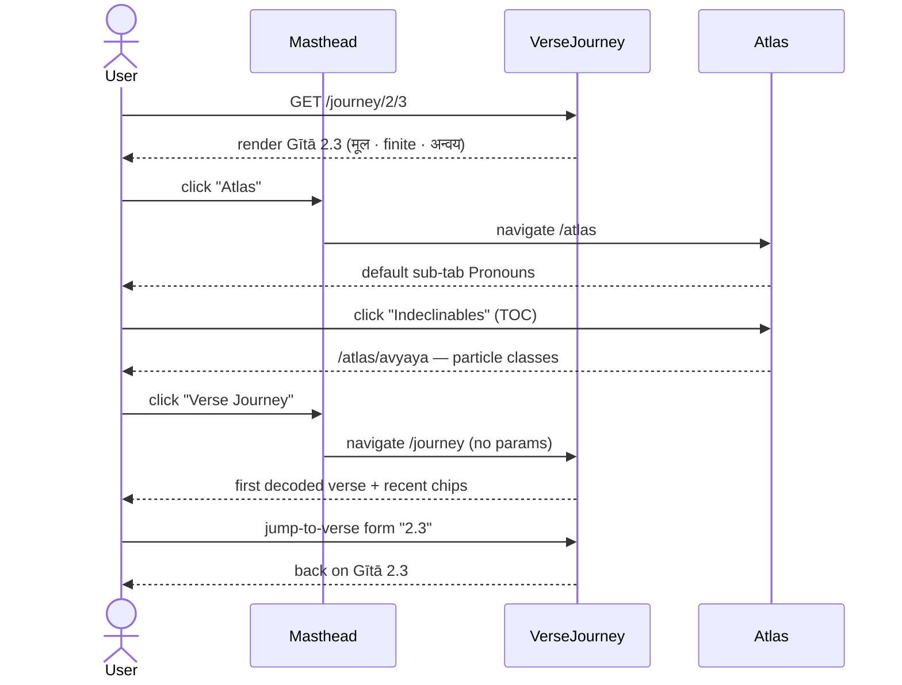

**Tested by** `it('W1 — verse 2.3 → Atlas/avyaya → return via jump form')`

---

## W2 — Sandhi confusion in verse → Sandhi Lab → return

The verse contains a tricky sandhi (e.g. **पाण्डवाश्चैव**). The verse's own सन्धि notes help, but the user wants to try the engine on the same string. They go to Sandhi Lab, paste, get the rule list, and come back.

**Steps**

1. Open `/journey/1/1` — Gītā 1.1 (मामकाः पाण्डवाश्चैव…).
2. Expand the सन्धि block — read the curated note.
3. Click **Atlas** → **Sandhi Lab**.
4. The Lab's default input is already `पाण्डवाश्चैव` (a preset).
5. Read the rule list (visarga, consonant, vowel sandhi).
6. Type a different sandhi candidate (e.g. **नैतत्**).
7. See it split into pieces with rule names.
8. Click **Verse Journey** to return.
9. Use jump-to-verse `1.1` to land back on the original.

**Why this matters.** Sandhi is the part of the curriculum the project deliberately taught last (per `CLAUDE.md`). The Lab is for when the verse's own notes don't cover what the user is staring at.

**Sequence diagram**

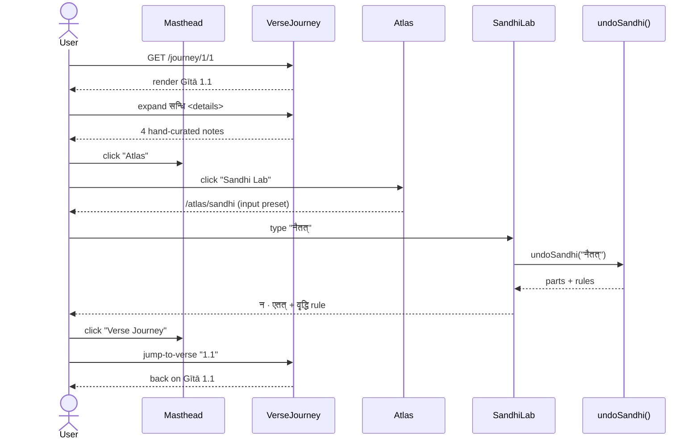

**Tested by** `it('W2 — verse 1.1 → Sandhi Lab → engine result → jump back')`

---

## W3 — Compound discovery — Bank → verse → see in context

Browsing the Compound Bank, the user finds a compound that interests them. They click the verse-ref to see the compound *in its verse*, not in isolation. This was the exact bug the user flagged before the router refactor.

**Steps**

1. Open `/atlas/samasa`.
2. Default mode is **Reference catalogue** — switch to **From your verses**.
3. The list now shows compounds with `Gītā c.v ↗` chips.
4. Click the first one — say `Gītā 2.13 ↗`.
5. Land on `/journey/2/13` — see the verse, including its समास list with the same compound.
6. Hit browser back (or click Atlas → Compounds again).
7. Land back on `/atlas/samasa` with the same mode + filter.

**Why this matters.** Reference data is sterile until you see it in real text. This round-trip is what makes the Bank feel connected to the corpus.

**Sequence diagram**

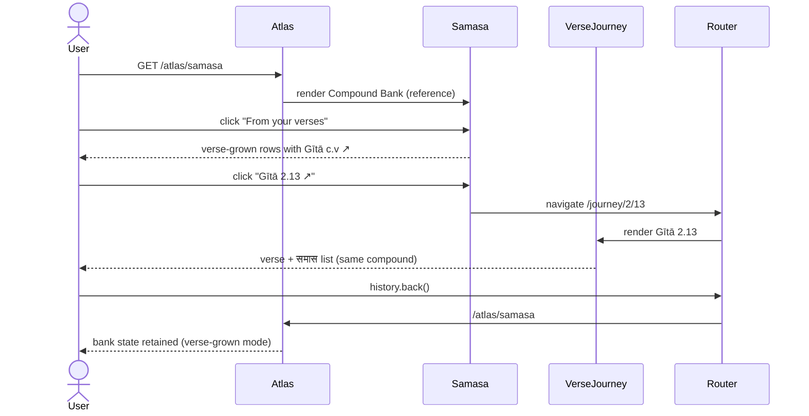

**Tested by** `it('W3 — Samāsa Bank verses-mode → click ref → land on verse with compound')`

---

## W4 — Verb deep-dive — Periodic Table → Stack Builder → reverse

The user spots a verb form they don't recognise (say **भविष्यति**). They visit the Verbs sub-app, find √भू, then switch to Stack Builder reverse mode and decompose the form.

**Steps**

1. Open `/verbs` — Periodic Table tab is default.
2. Find and click the **भू** cell.
3. Right pane (DhatuDetail) shows √भू info.
4. Click **Stack Builder** in the Verbs sub-tabs.
5. Forward mode: see `भव + ति = भवति` (default लट् prathama eka).
6. Switch to **Reverse — decode a form**.
7. Type `भविष्यति` into the input.
8. See match → लृट् prathama eka, P, गण 1.

**Why this matters.** Periodic Table is recognition; Stack Builder is generation/deconstruction. Going from one to the other in a single session is the exact "+1" pedagogy from bvsiitm — start with what you know, drill the next thing.

**Sequence diagram**

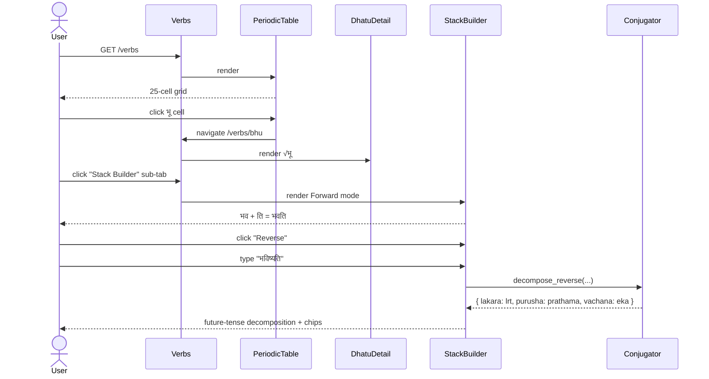

**Tested by** `it('W4 — Periodic Table → Stack Builder Reverse → decode भविष्यति')`

---

## W5 — Multi-verse exploration via search + jump

The user wants to study every verse where Krishna addresses Arjuna by an epithet. They search, jump between matches, then return to a known anchor verse.

**Steps**

1. Open `/journey` — first decoded verse selected.
2. Type `पार्थ` in the rail search.
3. See result list with hits + verse refs.
4. Click first result → land on that verse.
5. Type a different term (e.g. `धर्म`) in search.
6. Click another result → another verse.
7. Use the **jump-to-verse** form (e.g. `2.3`) to return to a memorised anchor.

**Why this matters.** The corpus is small now (25 verses) but designed to scale. Search + jump are the two scaling mechanisms — needed even at 50 verses, mandatory at 200+.

**Sequence diagram**

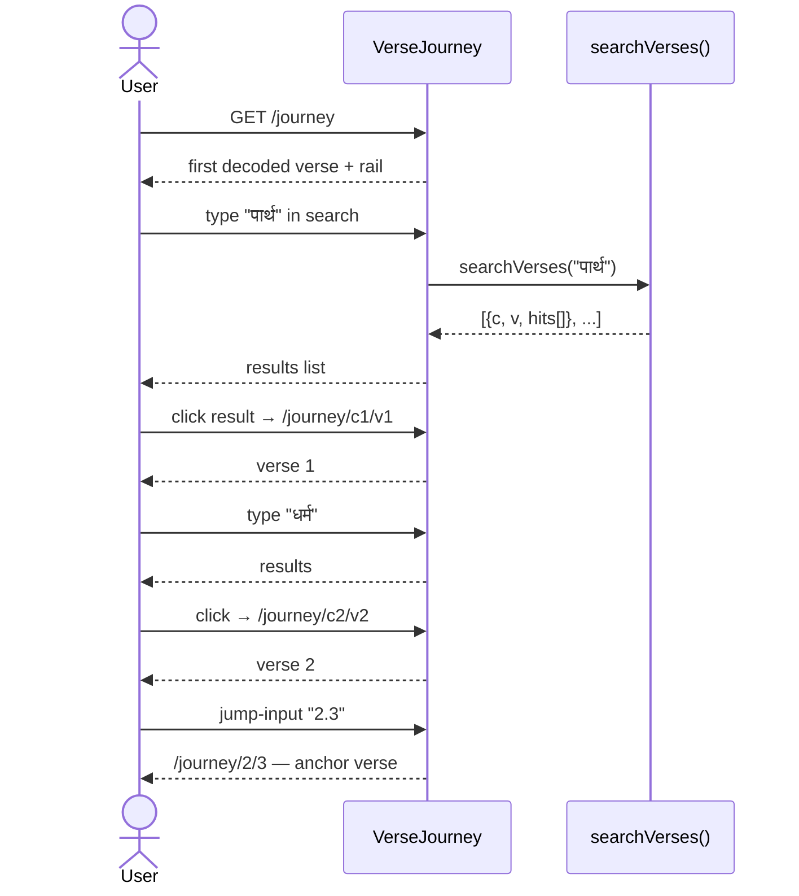

**Tested by** `it('W5 — search → jump → search → jump-to-verse anchor')`

---

## W6 — Theme switch persists across navigation

A small but real workflow: the user picks a theme in one tab, then navigates around. The theme must persist (DOM + localStorage) and not reset between tabs.

**Steps**

1. Open `/journey` with default theme.
2. Open ThemePicker in the masthead.
3. Pick a non-default palette (e.g. **Ink & Vermillion**).
4. `<html data-theme>` updates immediately.
5. `localStorage['theme_v1']` stores the new id.
6. Navigate to `/atlas/samasa`.
7. Theme still applied (`data-theme` unchanged).
8. Navigate to `/verbs`.
9. Still applied.

**Why this matters.** The masthead is rendered once at the App level; navigation does not unmount it. But this is easy to break with a routing refactor (e.g. if the masthead were inside a route).

**Sequence diagram**

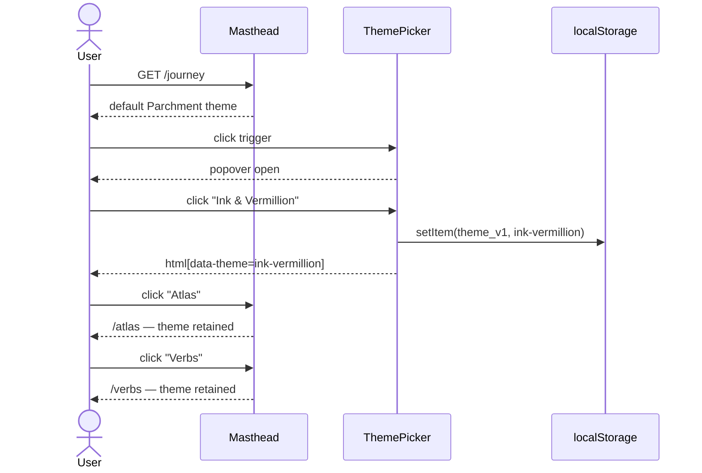

**Tested by** `it('W6 — switch theme on /journey, persists across /atlas + /verbs navigation')`

---

## W7 — Patterns Won → first-met verse → context

The user reviews their Patterns Won matrix, sees a pattern (e.g. *सामानाधिकरण्य*), and clicks the first-met verse-ref to see the pattern in actual context.

**Steps**

1. Open `/patterns`.
2. Filter / search for a pattern of interest.
3. The **First met** column shows a clickable `Gītā c.v ↗` link.
4. Click it → land on `/journey/c/v`.
5. Read the verse — see the pattern in अन्वय / finite-verb section.
6. Click **Patterns Won** in masthead.
7. Land back on `/patterns` (state may reset; that's the current behaviour).

**Why this matters.** Patterns are abstractions; verses are evidence. The link from abstract to concrete is what makes patterns trustworthy.

**Sequence diagram**

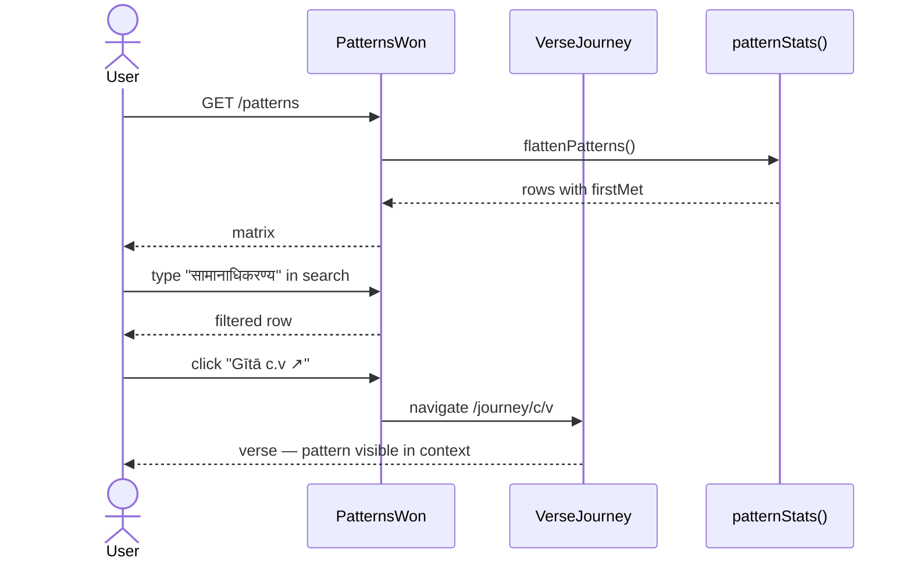

**Tested by** `it('W7 — Patterns Won → click first-met verse-ref → land on verse')`

---

## W8 — Type Identifier drill → Type Reference → drill again

Within Samāsa, the user picks the wrong type on a drill. They consult the Type Reference, read the rule, then return to the drill and answer correctly next time.

**Steps**

1. Open `/atlas/samasa`.
2. Switch to **Type identifier (drill)** view.
3. See a compound + विग्रह; pick a wrong type — score 0/1.
4. Feedback shows the correct type.
5. Click **Type reference** view to read the full rule for that type.
6. Click back to **Type identifier (drill)**.
7. Drill state is fresh (component re-mounts on view-switch — by design or trade-off).

**Why this matters.** The drill is for retrieval practice; the reference is for filling holes. The user oscillates between them as gaps surface.

**Sequence diagram**

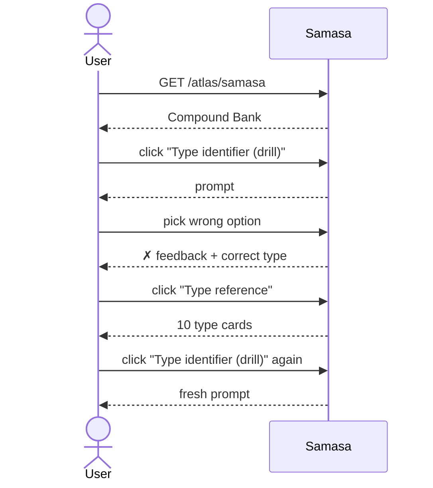

**Tested by** `it('W8 — drill wrong → Type Reference → return to drill')`

---

## W9 — Decode Helper → paste new verse → copy stub

The user has a verse not yet in the corpus. They paste the mūla into Decode Helper, the engine produces an auto-stub, they copy it for pasting into `verses.js`.

**Steps**

1. Open `/decode`.
2. Set chapter `4`, verse `8`.
3. Paste the mūla into the textarea.
4. The engine produces पदच्छेद, sandhi notes, finite-verb candidates.
5. JS preview shows the stub keyed at `chapter: 4, verse: 8`.
6. Click **Copy** — clipboard receives the JS.
7. Label flips to **✓ Copied** for ~2s.

**Why this matters.** This is a developer-as-user workflow; the curve from "I want to add a verse" to "I have a paste-ready stub" must be short enough that the user actually adds verses.

**Sequence diagram**

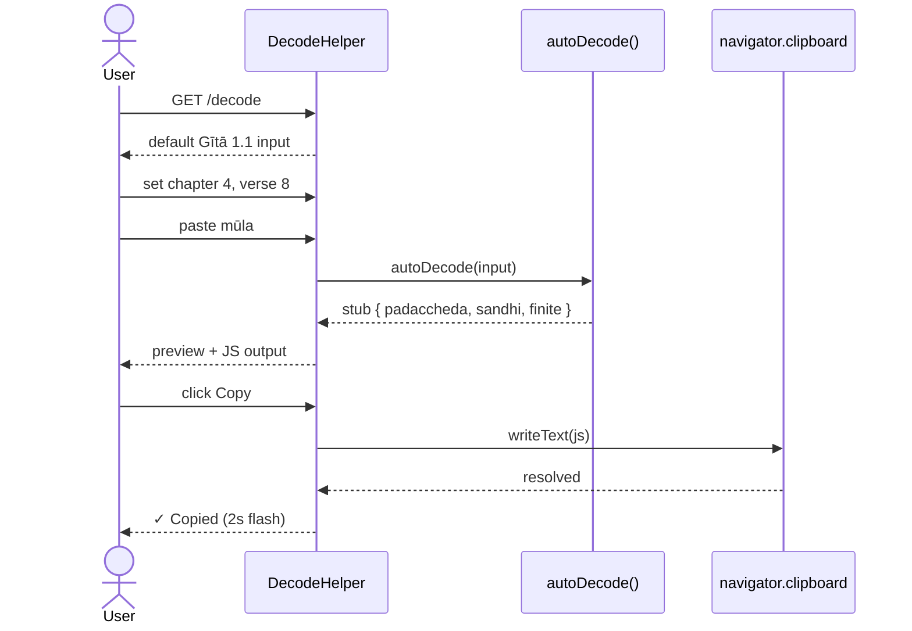

**Tested by** `it('W9 — Decode helper → set ch/v → engine → Copy → clipboard called')`

---

## W10 — Practice session → study source → return

The user starts a Practice session, fails a card, ends the session, navigates to the source verse to study it, returns to Practice and starts again.

**Steps**

1. Open `/practice`.
2. Click **Start session** — see a card.
3. Click **Show answer** → see answer + 4 rating buttons.
4. Click **Again** (failed it).
5. Either advances or session ends; for this workflow, **End session**.
6. Click **Verse Journey** in masthead.
7. Look up the source verse (via search or jump).
8. Read the verse — internalise the form.
9. Click **Practice** in masthead.
10. Stats now reflect the failed review.
11. Click **Start session** to retry.

**Why this matters.** SRS only works when failure → study → re-review. The bridge between Practice and the Journey is what closes the loop. If that bridge is broken (or hidden), users spam Easy and learn nothing.

**Sequence diagram**

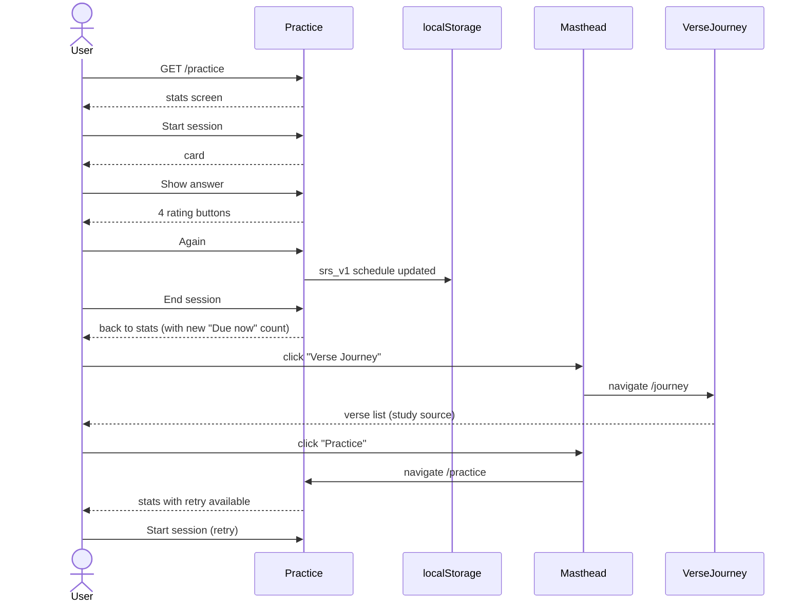

**Tested by** `it('W10 — Practice fail → study verse → return to Practice with updated SRS')`

---

## W11 — Recognize a noun's case → look up its full paradigm

The user is reading a verse, clicks a noun, sees its parsing in the popover (e.g. **भीष्मम्** is `द्वितीया एकवचन पुल्लिङ्ग`). They already know the देव paradigm from school but want to see ALL the forms — and check whether other words in the verse follow the same paradigm or a different one.

**Steps**

1. Open `/journey/2/4` — Gītā 2.4 (कथं भीष्ममहं सङ्ख्ये…).
2. Click the **भीष्मम्** chip in पदच्छेद. Popover shows: category=noun, root=भीष्म, gender=पुं., number=एक, case=द्वितीया.
3. Realize: this is exactly देवम् structurally. Want to see the full देव paradigm.
4. Navigate to `/atlas/declensions`.
5. देव paradigm is selected by default; see all 24 forms.
6. Verify the pedagogy note: it explicitly mentions भीष्मम् in 2.4 as the trigger word.
7. Click the corpus example "Gītā 2.4 ↗" for भीष्मम् — return to verse 2.4.

**Why this matters.** The whole point of recognizing case is to apply known declension knowledge to unknown words. The Atlas → Declensions tab makes that bridge explicit: pick a paradigm, see all 24 forms, see which corpus words follow it.

**Sequence diagram**

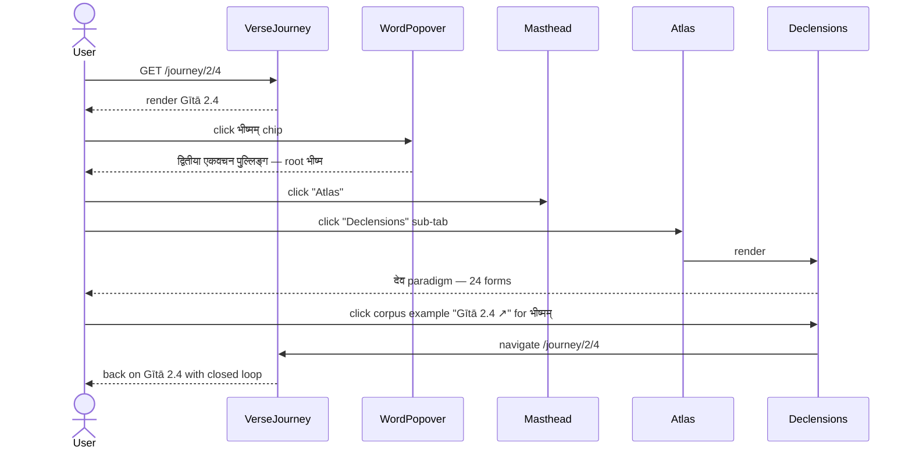

**Tested by** `it('W11 — verse 2.4 → Atlas/declensions → corpus example back to verse')`
